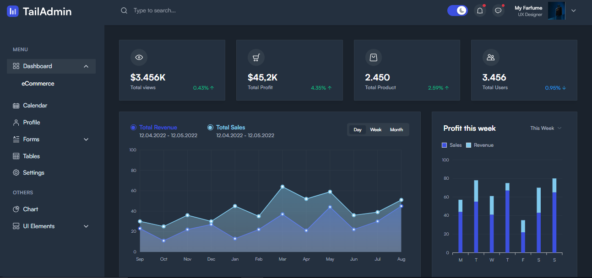
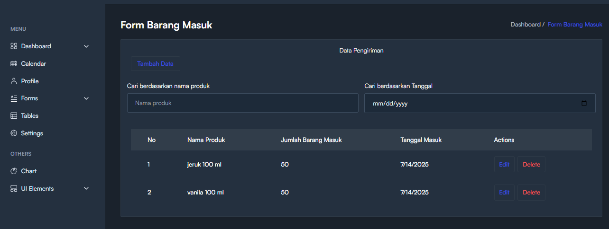
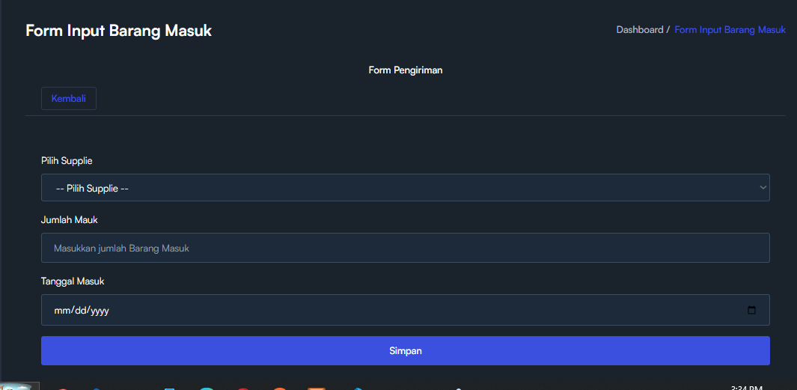
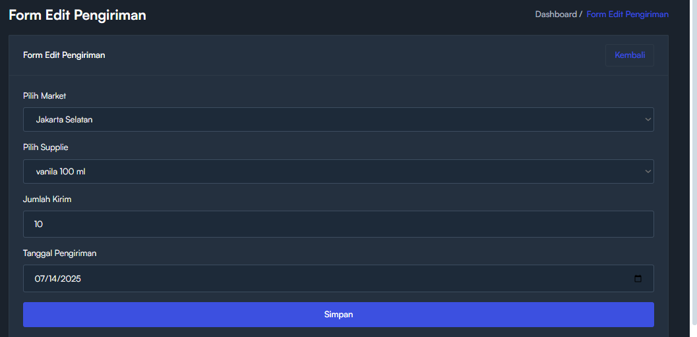
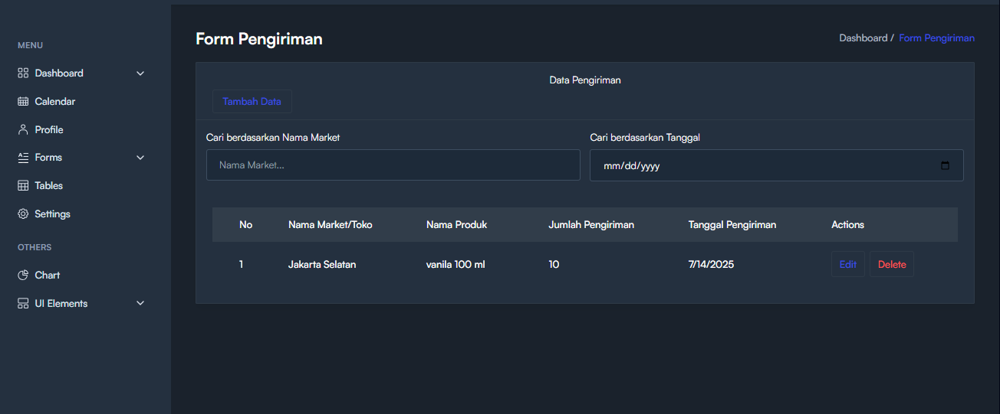
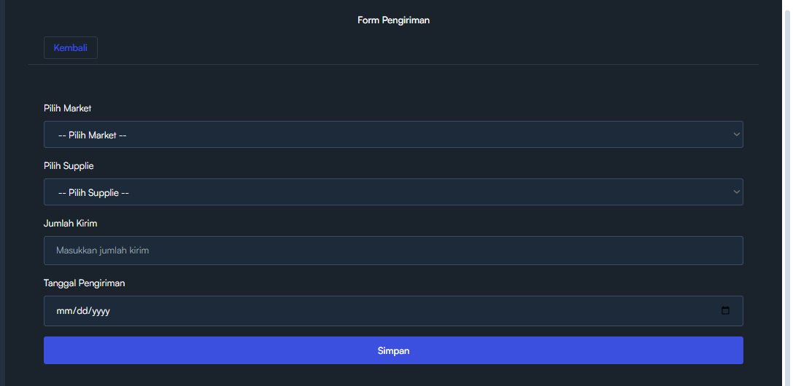
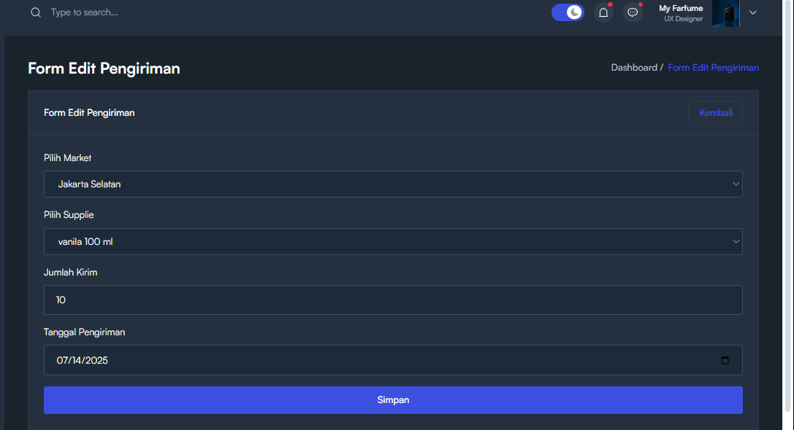

## Sistem Pengelolaan Data Penjualan Farfum

Farfum adalah aplikasi pengelolaan data penjualan parfum yang dirancang untuk membantu Anda memantau, menganalisis, dan mengelola penjualan di setiap cabang secara efisien dan aplikasi sudah saya push di github dengan judul Backend **Farfume** dan Frontend dengan judul  **FarfumeFrontend**.

✨ Fitur Utama
Manajemen Data Cabang: Pantau penjualan di setiap cabang secara detail.

Perhitungan Otomatis: Sistem sudah dilengkapi perhitungan aritmatika otomatis untuk memudahkan rekap data.

Grafik Penjualan: Visualisasi data penjualan melalui grafik interaktif.

Export Data: Fitur export data penjualan untuk kebutuhan laporan.

Backend API: Backend sudah terpisah dengan arsitektur RESTful API yang siap diintegrasikan.

🚧 Status Pengembangan
✅ Backend API 100% selesai

✅ Perhitungan & export data selesai

✅ Visualisasi data melalui grafik selesai

🛠️ Desain antarmuka masih dalam tahap pengembangan

🎯 Tujuan
Membantu manajemen cabang parfum Fermfume agar dapat:

Memantau performa penjualan di tiap cabang.

Mengoptimalkan strategi penjualan berdasarkan data aktual.

Membuat laporan penjualan dengan cepat dan akurat.

* Berikut beberapa tampilan dari aplikasi yaitu login

* Berikut tamplan dari ecomerse dalam tahap pengerjaan

* Berikut tamplian form utama, input, dan edit, barang masuk

  

* Berikut form utama, input, dan edit, pengiriman barang

  

* Berikut tamplan stok gudang yang terisi otomatis dengan berlelasikan form pengiriman form barang masuk form penjualan

* Berikut tamplan stock barang permasing toko terisi otomatis juga berlelasikan pengiriman, barang masuk, dan penjualan

* Berikut tampilan crud Market dan Suplay

 

* Berikut tampilan ukuran botol

* Berikut tampilan form penjualan input dan edit. di bagian input pejualan sudah di konversikan ke mililiter

  

* Saya juga sudah masukan fitur grafik di form penjualan, pengiriman, gudang, stok market dan barang masuk

* berikut tampilan hak akses 

 

* Dan saya juga sudah masukan fitur export exsel di form penjualan, pengiriman, gudang, stok market dan barang masuk berikut contok tampilan exsel

Terima kasih telah melihat proyek ini. Kontribusi, saran, dan masukan sangat saya harapkan untuk pengembangan aplikasi ini ke depannya.
