# 🌸 Sistem Pengelolaan Data Penjualan Farfum

**Farfum** adalah aplikasi pengelolaan data penjualan parfum yang dirancang untuk membantu Anda memantau, menganalisis, dan mengelola penjualan di setiap cabang secara efisien.

Aplikasi ini dibangun menggunakan **framework Laravel** untuk backend dan **React** untuk frontend, dan telah saya unggah ke GitHub dengan nama repository:  
- Backend: **Farfume**  
- Frontend: **FarfumeFrontend**

---

## 🎯 Fitur Utama

- **Manajemen Data Cabang:** Pantau penjualan di setiap cabang secara detail.
- **Perhitungan Otomatis:** Perhitungan aritmatika otomatis untuk rekap stok & penjualan.
- **Grafik Penjualan:** Visualisasi data melalui grafik interaktif.
- **Export Data:** Ekspor data penjualan ke format Excel.
- **Role Management:** Pengaturan hak akses pengguna oleh Super Admin.
- **Backend API:** Menggunakan arsitektur RESTful API.

---

## 📈 Tujuan

Aplikasi ini dibuat untuk membantu manajemen parfum Fermfume agar dapat:
- Memantau performa penjualan tiap cabang.
- Mengoptimalkan strategi berdasarkan data nyata.
- Membuat laporan penjualan cepat dan akurat.

---

## 🚧 Status Pengembangan

✅ Backend API tahap penyelesaian  
✅ Perhitungan otomatis & fitur ekspor selesai  
✅ Grafik dan visualisasi selesai  
🛠️ Desain antarmuka masih dalam pengembangan

---

## 📸 Tampilan Aplikasi

### 🔐 Login

### 🛍️ E-commerce
Untuk tampilan ecomerse sedang dalam tahap pengembangan
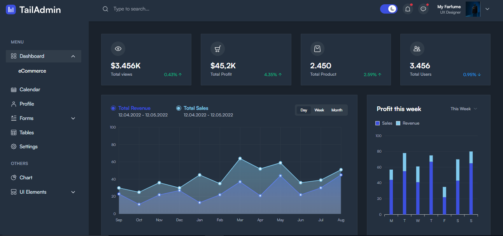

### 📦 Barang Masuk
- Form Utama  
  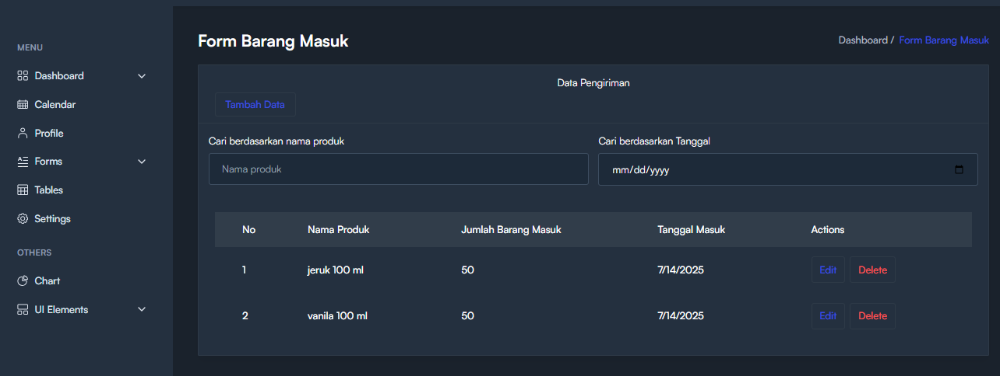  
- Input  
  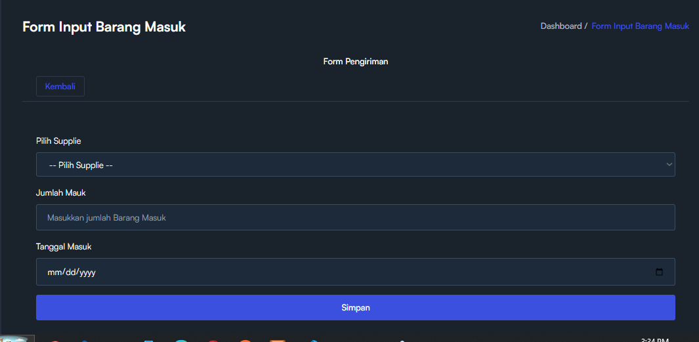  
- Edit  
  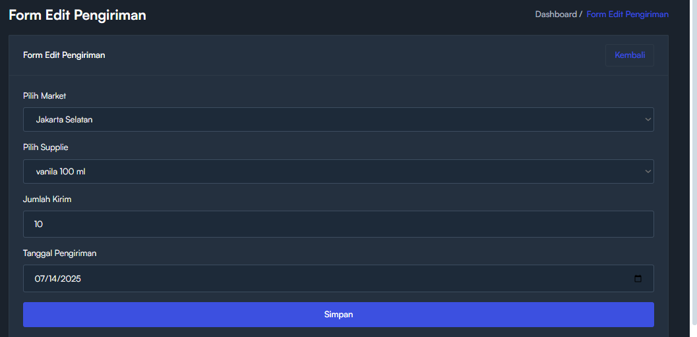

### 🚚 Pengiriman Barang
- Form Utama  
  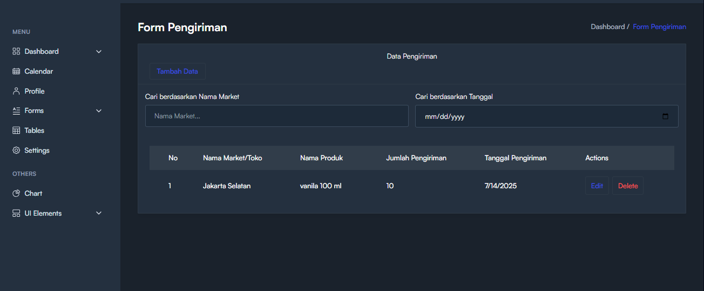  
- Input  
  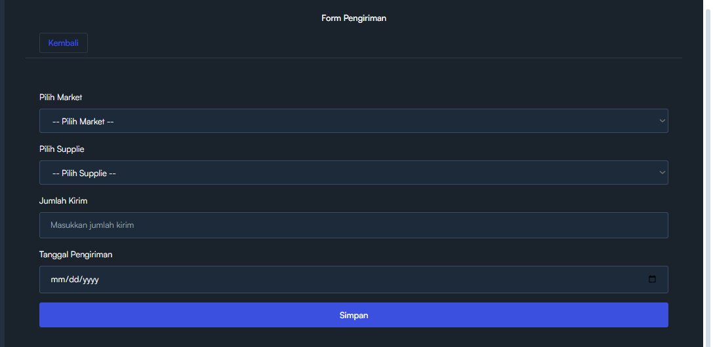  
- Edit  
  

### 🏢 Stok Gudang 
Stok gudang akan otomatis terisi menggunakan logika aritmatika dan relasi
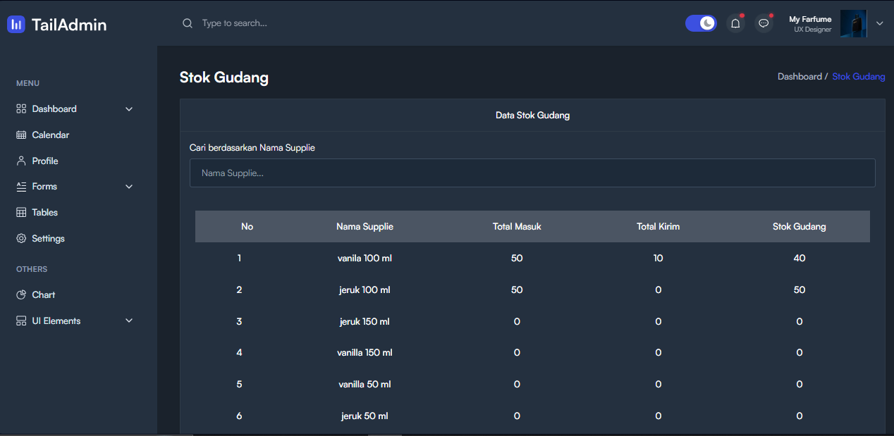

### 🏬 Stok per Toko 
Begitupun stok toko akan otomatis terisi menggunakan logika aritmatika dan relasi

### 🏷️ Market & Supplier
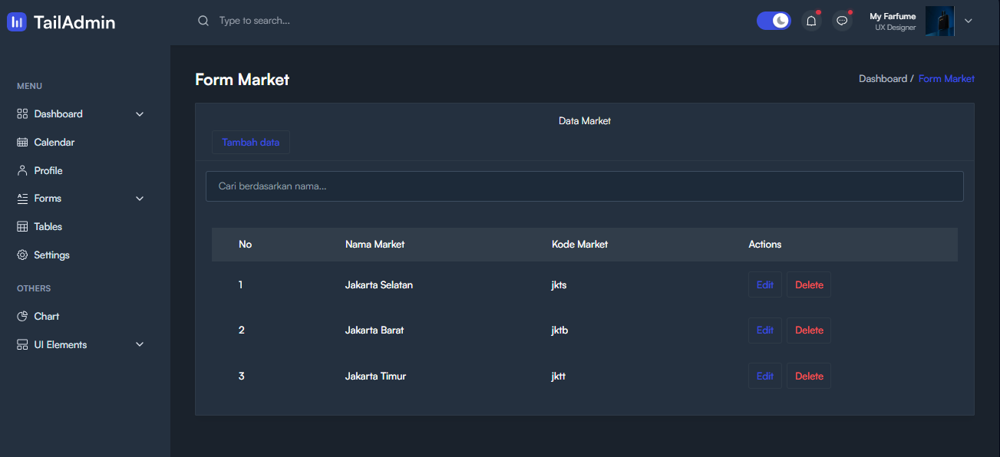  
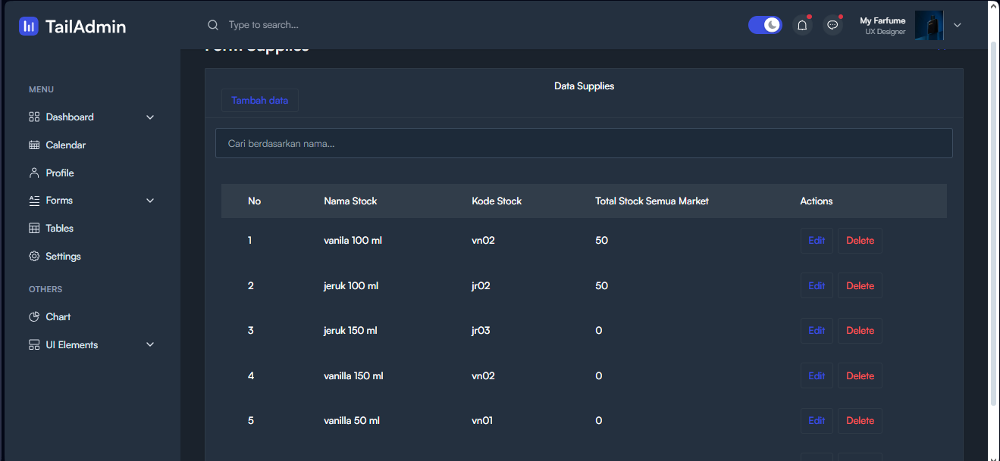

### 🧴 Ukuran Botol
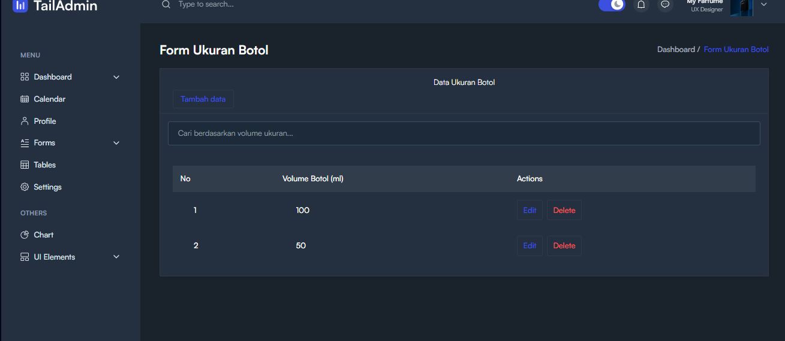

### 💸 Penjualan
- Form Utama  
  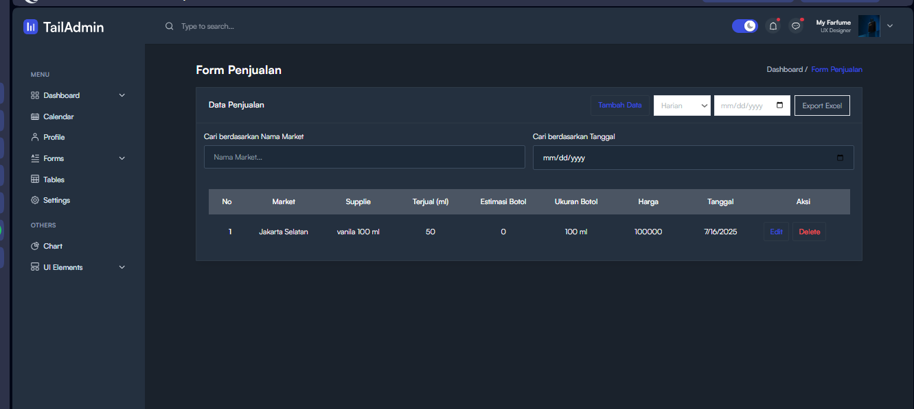  
- Input penjualan di konversikan kedalam mililiter
  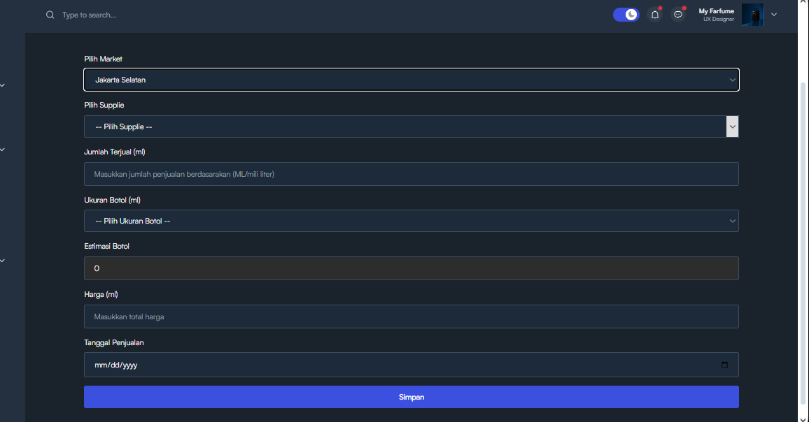  
- Edit  
  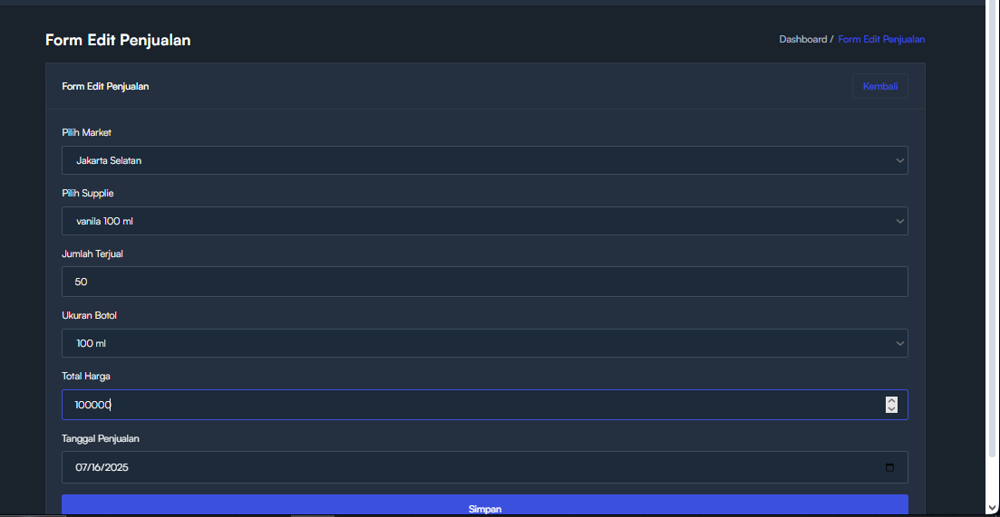

### 📊 Grafik Penjualan & Stok
Grafik juga tersedia di berbagai halaman: penjualan, pengiriman, gudang, dan stok.  
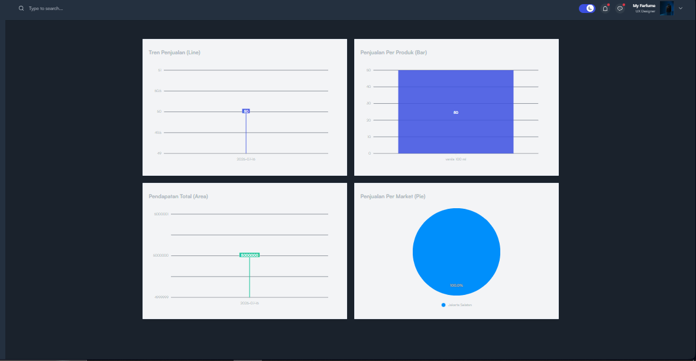

### 🔐 Hak Akses (Role Management)
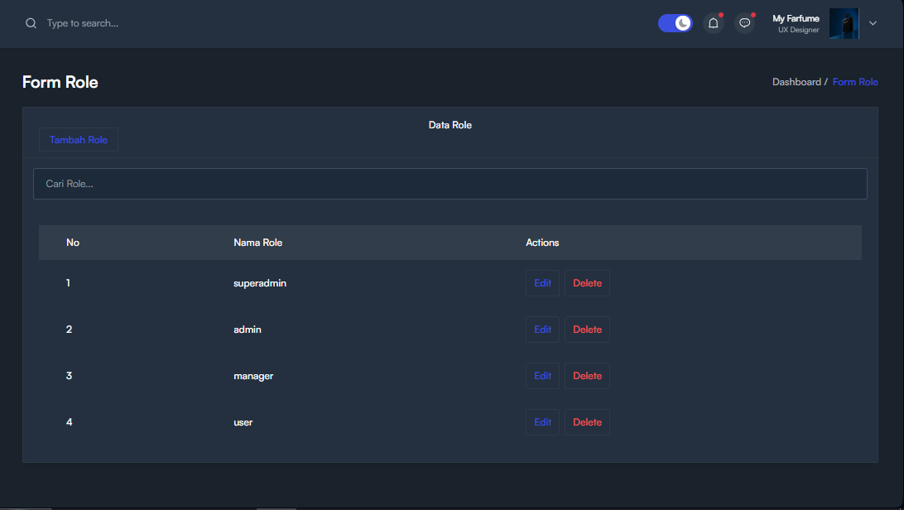  
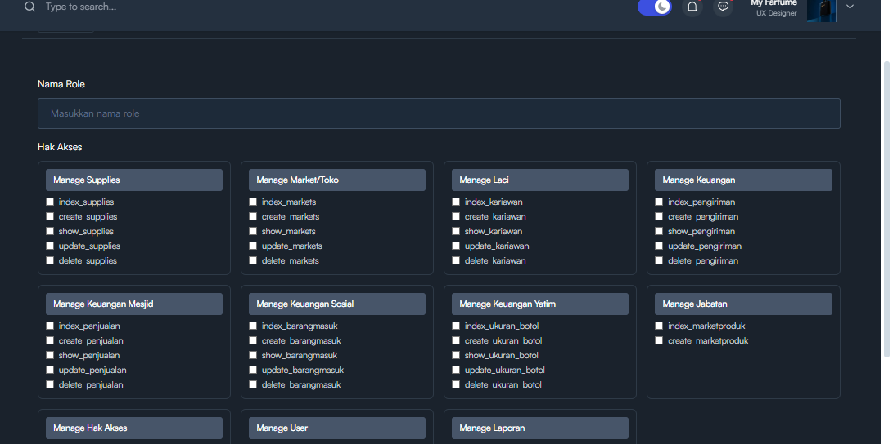

### 📤 Export ke Excel
Contoh tampilan hasil export:  
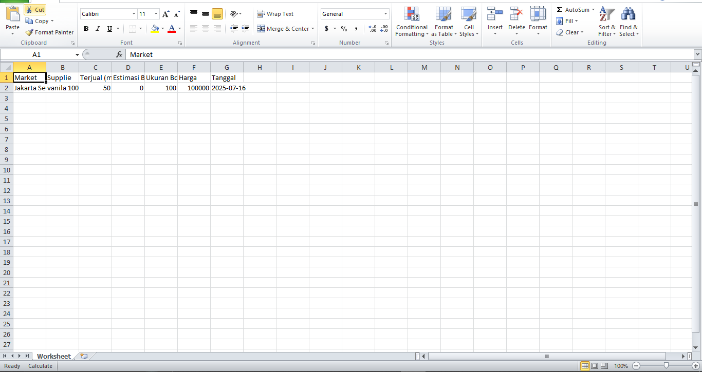

---

## ✉️ Terima Kasih

Terima kasih telah melihat proyek ini.  
Saya sangat menghargai setiap saran, kritik, atau masukan untuk pengembangan lebih lanjut ke depannya.
