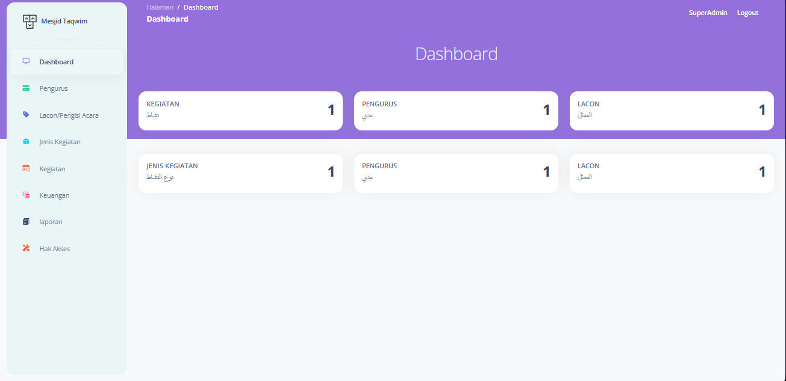

## Sistem Pengelolaan Data Mesjid
“Proyek pertama saya: Aplikasi Pengelolaan Masjid. Dibuat sebagai Tugas Akhir dengan tujuan membantu masyarakat perantau memantau kegiatan, laporan keuangan, dan informasi masjid secara online. Sistem ini menggantikan proses manual, menuju manajemen yang lebih efisien, transparan, dan akuntabel. pembuatan aplikasi saya menggunakan fremwork laravel dan sudah saya push di repositori dengan judul Finising TA”

* Berikut adalah tampilan utama
  
-Terdapat halaman Home visi dan misi

-Halaman Berita yaitu informasi mesjid seperti keuangan acara dll

-Halaman kontak pesan user bisa berupa mesjid atau aplikasi

-Dan halaman login admin

* Halaman Login
  

* Halaman Utama dashboard
  

* halaman pengurus ada data pengurus beserta jabatannya, disini terdapat crud pengurus dan crud jabatan
  

* Halaman berikut terdapat crud Nama Ust yang akan mengisi acara seperti khubah dll dan akan di tampilkan di halaman berita
  

* Halamat berikut berisi crud jenis kegiatan, sebagai relasi ke halaman kegiatan
  

* Halaman crud kegiatan saya buat dalam bentuk kalender agar lebih efesien mengingat waktu tanggal acara di mulai, pada tanggal dapat mengklik acara untuk menampilkan detail acara
  

* Berikut adalah halaman keuangan
  

* Tampilan salah satu crud keuangan
  
 

* Selanjutnya adalah hak akses, berikut tamplian crud dengan mengklik satu-satu mana saja yang halaman yang boleh dikelola user contoh Bendahara mengelola keuangan yang di atur superadmin yaitu ketua pengurus
  

* Berikut halaman untuk pebuatan akun login untuk user lain yang di kelola oleh super admin
  

* Berikut pesan atau masukan untuk pengurus yang di tulis di halaman umum kontak
  

Terima kasih telah melihat proyek ini. Kontribusi, saran, dan masukan sangat saya harapkan untuk pengembangan aplikasi ini ke depannya.

